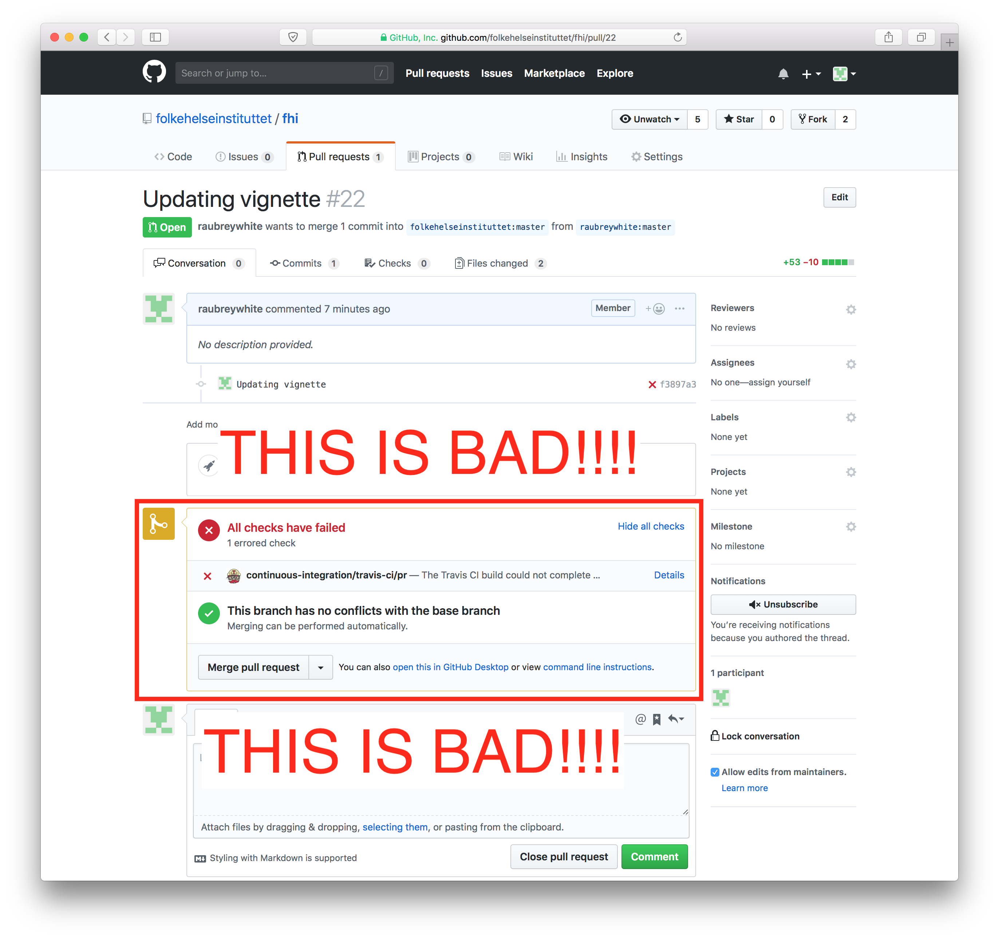

# test

## Development guidelines

We try to follow the [GitHub flow](https://guides.github.com/introduction/flow/) for development.

1. Fork [this repo][repo] and clone it to your computer. To learn more about this process, see [this guide](https://guides.github.com/activities/forking/).
2. Add the Folkehelseinstituttet repository as your upstream:
```
git remote add upstream https://github.com/folkehelseinstituttet/ORIGINAL_REPOSITORY.git
```
3. If you have forked and cloned the project before and it has been a while since you worked on it, merge changes from the original repo to your clone by using:
```
git fetch upstream
git merge upstream/master
```
4. Open the RStudio project file (`.Rproj`).
5. Make your changes:
    * Write your code.
    * Test your code (bonus points for adding unit tests).
    * Document your code (see function documentation above).
    * Do an `R CMD check` using `devtools::check()` and aim for 0 errors and warnings.
    * Commit your changes locally
    * Merge changes from the original repo (again)
    * Do an `R CMD check` using `devtools::check()` and aim for 0 errors and warnings.
6. Commit and push your changes.
7. Submit a [pull request](https://guides.github.com/activities/forking/#making-a-pull-request).
8. If you are reviewing the pull request, wait until the [travis-ci](www.travis-ci.org) unit tests have finished

```{r echo=FALSE, message=FALSE, warning=FALSE}
knitr::include_graphics("images/pull_request_before_checks.png")
```

9. Please make sure that the unit tests `PASS` before merging in!!

```{r echo=FALSE, message=FALSE, warning=FALSE}

```

## Code style

- Function names start with capital letters
- Variable names start with small letters
- Environments should be in ALL CAPS
- Reference [Hadley's style code](http://adv-r.had.co.nz/Style.html)
- <- is preferred over = for assignment
- Indentation is with two spaces, not two or a tab. There should be no tabs in code files.
- if () {} else {} constructions should always use full curly braces even when usage seems unnecessary from a clarity perspective.
- TODO statements should be opened as GitHub issues with links to specific code files and code lines, rather than written inline.
- Follow Hadley’s suggestion for aligning long functions with many arguments:
```
 long_function_name <- function(a = "a long argument", 
                                b = "another argument",
                                c = "another long argument") {
   # As usual code is indented by two spaces.
 }
```
- Never use print() to send text to the console. Instead use message(), warning(), and error() as appropriate.
- Use environment variables, not options(), to store global arguments that are used by many or all functions.
